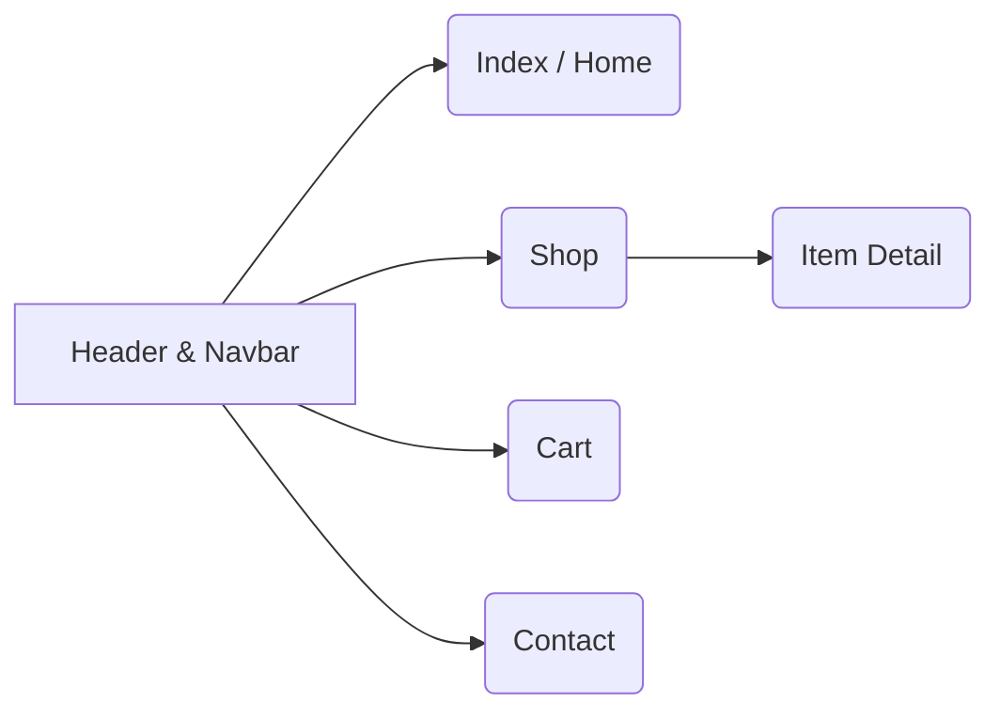

# **E-Commerce Website — Frontend UI**

A clean, responsive storefront built with **HTML**, **CSS**, and **vanilla JavaScript**. Visitors can browse featured and new products, view item details (size & quantity), manage a cart summary, and reach the store via an embedded Google Map and contact form.&#x20;

---

## **Table of Contents**

* [Features](#features)
* [Live Pages](#live-pages)
* [Architecture & Pages](#architecture--pages)
* [Project Structure](#project-structure)
* [Styling & Responsiveness](#styling--responsiveness)
* [Interactions](#interactions)
* [Run Locally](#run-locally)
* [Screenshots](#screenshots)

---

## **Features**

* **Homepage & Promotions** — Hero section (“Super value deals”), feature grid, featured & new arrivals, and promotional banners.&#x20;
* **Shop Catalog** — Product grid with rating stars; clicking a card can navigate to the item detail page. &#x20;
* **Product Details** — Gallery with thumbnail strip, **size** selector, **quantity** selector, and **Add to Cart** CTA; long-form description.&#x20;
* **Cart Summary** — Table view of items, quantity dropdown, coupon entry, and computed totals block.&#x20;
* **Contact Page** — Store details, **embedded Google Map**, newsletter signup block, and a contact form.&#x20;
* **Responsive Header & Nav** — Top nav with desktop and mobile states; sticky header with cart icon. &#x20;

---

## **Live Pages**

* `index.html` — Home / Landing.&#x20;
* `shop.html` — Catalog / Listing.&#x20;
* `ItemDetail.html` — Product details.&#x20;
* `cart.html` — Cart summary.&#x20;
* `contact.html` — Map + contact form.&#x20;

> Tip: All pages share a common **header** (`#header`) and **navbar** (`#navbar`) for consistent navigation.&#x20;

---

## **Architecture & Pages**



* **Home**: Hero (`#HomeHeaderContent`), feature tiles, featured/new product grids, banners, and newsletter.&#x20;
* **Shop**: Product grid, header banner (`#ShopPageheader`), and pagination. &#x20;
* **Item Detail**: Main image (`#MainImg`) with thumbnail options; size and quantity dropdowns; add-to-cart.&#x20;
* **Cart**: Tabular summary with remove icons, quantity selectors, and coupon/total block.&#x20;
* **Contact**: Address, email, phone, hours, **Google Maps iframe**, and contact form fields.&#x20;

---

## **Project Structure**

```
/               # static site (no build step)
├─ index.html
├─ shop.html
├─ ItemDetail.html
├─ cart.html
├─ contact.html
├─ style.css
├─ script.js         # dropdowns, gallery & small UI helpers (referenced by pages)
└─ img/...           # logos, banners, product images
```

Pages link a shared stylesheet and Font Awesome icons; layout classes and IDs are defined in `style.css`. &#x20;

---

## **Styling & Responsiveness**

* **Typography & Base** — Google **Spartan** font; global resets; semantic headings (`h1`…`h6`).&#x20;
* **Layout System** — Section paddings (`.section-p1`), hero/banner backgrounds, product grid card styles (`#product1 .pro`), and newsletter bar.&#x20;
* **Nav & Header** — Sticky header, desktop & mobile controls (`#mobile`, `#bar`, `#close`), and active link styles.&#x20;
* **Components** — Dropdown menus (`.dropdown-content`), pagination, buttons, and icon badges.&#x20;
* **Pages** — Shop banner (`#ShopPageheader`), Product detail layout (`#Product-Detail-Container`), Contact layout (`#ContactDetailContainer`), and Cart table styles.&#x20;

---

## **Interactions**

* **Product gallery**: Thumbnails update the main image (`#MainImg`) on the product page.&#x20;
* **Size & Quantity pickers**: Dropdowns call `toggleDropdown('...')` and `updateButtonText('...', this)` for selection; used on **Item Detail** and **Cart** rows. &#x20;
* **Catalog navigation**: A product card click can deep-link to the detail page (`onclick="window.location.href='ItemDetail.html';"`).&#x20;
* **Map**: Embedded Google Maps iframe on the Contact page.&#x20;

> Scripts are lightweight and page-scoped; HTML uses unobtrusive IDs/classes so you can swap in any SPA framework later without changing the markup.

---

## **Run Locally**

Because this is a static site, you can open `index.html` directly or serve it with any static server.

**Option A — Open directly**

* Double-click `index.html` in your file explorer.

**Option B — Simple HTTP server (recommended)**

```bash
# Python 3
python -m http.server 5173

# or Node (if installed)
npx serve .
```

Then visit `http://localhost:5173/index.html`.

---

## **Screenshots**


<br><br>
<br><br>
<br><br>
<br><br>
<br><br>
<br><br>


